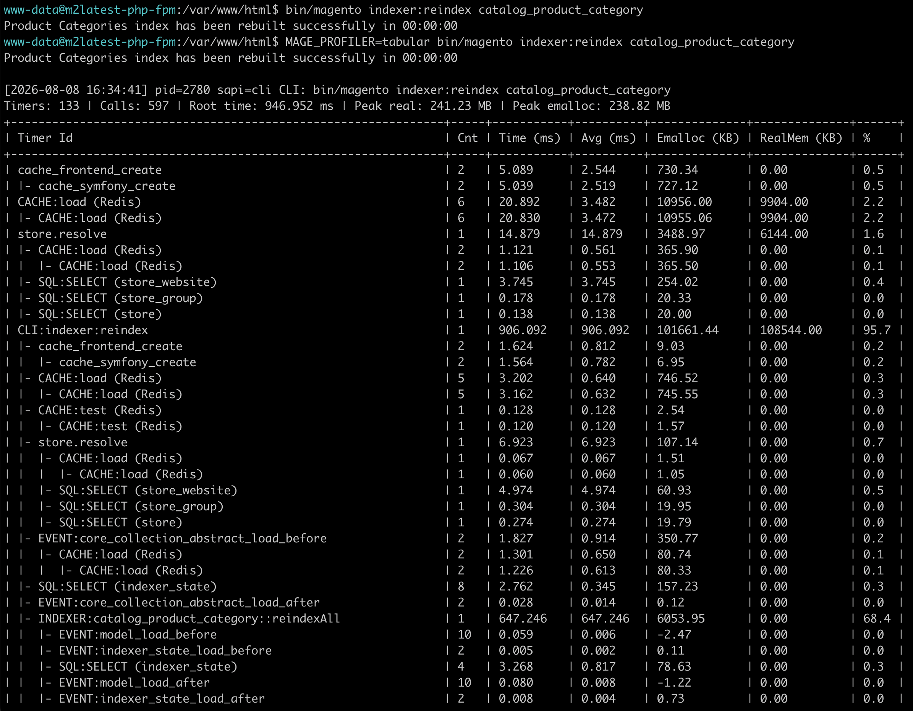
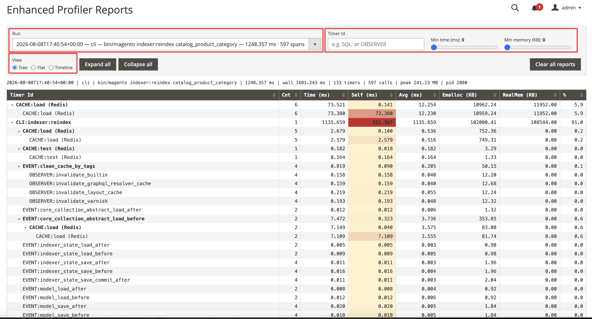

<div align="center">

# Magento 2 Enhanced Profiler


</div>

<div align="center">

[](https://packagist.org/packages/magepsycho/magento2-profiler)
[](https://packagist.org/packages/magepsycho/magento2-profiler/stats)


</div>

## Overview
**Magento 2 Enhanced Profiler adds** a **`tabular`** and a **`json`** profiler output type to Magento 2 — a third and fourth option next to the built-in `html` and `csvfile`.

It profiles **all three request types from one switch**: storefront and admin **web** requests, **REST and GraphQL API** requests, and **CLI** commands. The last two stock Magento cannot profile at all — `html` writes into the response body, which is useless for JSON endpoints and impossible for a console command. On web requests this writes to a log file instead of appending a table to the page.

No core file is patched: activation happens in `bootstrap.php`, before the ObjectManager exists, which is the only moment early enough to catch the whole request.

```
[2026-08-04 02:07:35] pid=68 sapi=fpm-fcgi GET /rest/V1/directory/currency
Timers: 19 | Calls: 21 | Root time: 73.567 ms | Peak real: 11.96 MB | Peak emalloc: 10.66 MB
+-------------------------------------------------------+-----+-----------+----------+--------------+--------------+------+
| Timer Id                                              | Cnt | Time (ms) | Avg (ms) | Emalloc (KB) | RealMem (KB) | %    |
+-------------------------------------------------------+-----+-----------+----------+--------------+--------------+------+
| cache_frontend_create                                 | 2   | 3.772     | 1.886    | 20.43        | 0.00         | 5.1  |
| magento                                               | 1   | 69.795    | 69.795   | 4277.05      | 2048.00      | 94.9 |
| |- store.resolve                                      | 1   | 10.267    | 10.267   | 73.98        | 0.00         | 14.0 |
| |- locale/currency                                    | 2   | 2.638     | 1.319    | 22.00        | 0.00         | 3.6  |
| |  |- EVENT:currency_display_options_forming          | 1   | 1.100     | 1.100    | 19.13        | 0.00         | 1.5  |
| |  |  |- OBSERVER:magento_currencysymbol_currency...  | 1   | 1.021     | 1.021    | 9.77         | 0.00         | 1.4  |
| |- EVENT:controller_front_send_response_before        | 1   | 3.941     | 3.941    | 23.90        | 0.00         | 5.4  |
+-------------------------------------------------------+-----+-----------+----------+--------------+--------------+------+
```

## Demo

`tabular` output on a CLI command:

<div align="center">



</div>

## Key Features
* Profiles **CLI commands** and **REST / GraphQL API** requests — neither of which stock Magento can profile at all
* Two output types that can run together: `tabular` (ASCII log) and `json` / `timeline` (structured per-run files)
* Captures aggregate rows **and** per-call spans, so a timeline is available without deciding before the run
* **SQL query profiling** on by default, with a per-table breakdown of every query
* Times DB, search, HTTP clients, GraphQL resolvers, Web API, indexers, mview, session handler, cache frontend and console commands
* Thresholds default to **zero** — core's `html` output hides everything under 1ms / 10 calls / 10KB, which drops most of an API request
* Filter noise by minimum duration or by PCRE on the timer id
* Log output is confined to `var/log/` and forced to a `.log` extension, so a report can never land somewhere web-served or executable
* Cookie activation is gated behind developer mode or a shared secret
* `Benchmark` helper for instrumenting your own code in a few lines
* Companion [**MagePsycho_ProfilerUi**](https://github.com/MagePsycho/magento2-profiler-ui) renders the reports in the admin

## Feature Highlights

### What Stock Magento Cannot Do

| Stock profiler | This extension |
|---|---|
| `html` appends a table to the response body — unusable for JSON endpoints | Writes to a log file or STDERR, never to the response |
| CLI commands cannot be profiled | `MAGE_PROFILER=tabular bin/magento <command>` prints the table after the run |
| REST / GraphQL cannot be profiled | Same switch, same table, per request |
| Thresholds hide anything under 1ms / 10 calls / 10KB | Thresholds default to zero; opt into filtering when you want it |
| No SQL visibility | Every query timed, grouped by operation and table |
| No structured output | One JSON file per run, with per-call spans |

### Output Types

Run either, or both together as `MAGE_PROFILER=tabular,json`:

| Type | Writes | Use |
|---|---|---|
| `tabular` | ASCII table appended to `var/log/profiler_tabular.log` | Reading in a terminal; STDERR on CLI |
| `json` (= `timeline`) | one structured file per run in `var/log/profiler/` | The [admin viewer](https://github.com/MagePsycho/magento2-profiler-ui), CI diffing, tooling |

`json` and `timeline` are two names for the same capture — aggregate `rows` **and** per-call `spans`. Set `MAGE_PROFILER_MAX_SPANS=0` for an aggregate-only file.

### Turning It On

Three ways, in order of scope:

```bash
# 1. one CLI command (Docker: -e goes before the container name)
MAGE_PROFILER=tabular bin/magento indexer:reindex catalog_product_price

# 2. one browser session or API client — cookie
#    MAGE_PROFILER=tabular   (developer mode, or tabular:<secret> otherwise)

# 3. everything, until switched off — flag file at var/profiler.flag
bin/magento magepsycho:profiler:enable
bin/magento magepsycho:profiler:status
bin/magento magepsycho:profiler:disable
```

For **REST / GraphQL requests from an API client** such as Postman, send the cookie as a plain request header:

```http
Cookie: MAGE_PROFILER=tabular
```

<div align="center">


</div>

The cookie is honoured only in **developer mode**. Anywhere else it must carry the shared secret — set `MAGE_PROFILER_SECRET` in the PHP environment and append it after the last output type:

```http
Cookie: MAGE_PROFILER=tabular:<secret>
Cookie: MAGE_PROFILER=tabular,json:<secret>
```

Store configuration cannot switch profiling on: activation happens during bootstrap, long before store config is readable. The admin settings control the **output** only.

### SQL Query Profiling

Every query is timed and grouped, so a slow reindex shows which tables it is spending its time in rather than one opaque total.

```bash
# which tables dominate a reindex?
MAGE_PROFILER=tabular MAGE_PROFILER_FILTER='/^SQL/' bin/magento indexer:reindex

# operation mix only, no per-table breakdown
MAGE_PROFILER=tabular MAGE_PROFILER_SQL=operation bin/magento indexer:reindex

# off, without touching the rest of the profiler
MAGE_PROFILER=tabular MAGE_PROFILER_SQL=0 bin/magento indexer:reindex
```

### Timeline And The Admin Viewer

The `json` output writes one file per run into `var/log/profiler/`, indexed by `index.jsonl` so a run picker can be built without opening every report.

Install the companion [**MagePsycho_ProfilerUi**](https://github.com/MagePsycho/magento2-profiler-ui) for an admin page at *System → Tools → Enhanced Profiler Reports*: a collapsible tree, a sortable and filterable table with the Self column heat-shaded, and a timeline of every call. It only reads what this module writes and adds nothing to the recording side, so it can be left uninstalled in production.

The same run, read in the browser instead of the log — this is what you get once `MagePsycho_ProfilerUi` is installed:

<div align="center">



</div>

```
composer require magepsycho/magento2-profiler-ui
```

### Instrument Your Own Code

```php
use MagePsycho\Profiler\Util\Benchmark;

Benchmark::start('my.expensive.thing');
// ...
Benchmark::stop('my.expensive.thing');
```

Timers nest automatically and appear in both outputs alongside the framework's own.

## 🛠️ Installation

### 1 Using Composer (Preferred)
```
composer require magepsycho/magento2-profiler
```

### 2 Using Modman
```
modman init
modman clone git@github.com:MagePsycho/magento2-profiler.git
```

### 3 Using Zip File
* Download the [Extension Zip File](https://github.com/MagePsycho/magento2-profiler/archive/master.zip)
* Extract & upload the files to `/path/to/magento2/app/code/MagePsycho/Profiler/`

After installation by either means, activate the extension with following steps

1. Enable the module
```
php bin/magento module:enable MagePsycho_Profiler --clear-static-content
php bin/magento setup:upgrade
```
2. Flush the store cache
```
php bin/magento cache:flush
```
3. Deploy static content - *in Production mode only*
```
rm -rf pub/static/* var/view_preprocessed/*
php bin/magento setup:static-content:deploy
```
4. Profile something
```
MAGE_PROFILER=tabular php bin/magento cache:clean
tail -f var/log/profiler_tabular.log
```

The extension creates no tables of its own.

## Configuration

**Stores > Configuration > MagePsycho > Enhanced Profiler > General Settings**

These control the **output** only — they cannot switch profiling on. Environment variables win over admin config.

| Setting | Env override | Default |
|---|---|---|
| Write Output | — | Yes |
| Log File Path (relative to Magento root) | `MAGE_PROFILER_LOG` | `var/log/profiler_tabular.log` |
| Minimum Timer Duration (ms) | `MAGE_PROFILER_MIN_MS` | `0` — show everything |
| Timer Id Filter (PCRE) | `MAGE_PROFILER_FILTER` | none |
| Print To STDERR On CLI | `MAGE_PROFILER_CLI_STDERR` | Yes |

Instrumentation itself is environment-only: `MAGE_PROFILER_SQL`, `MAGE_PROFILER_MAX_DETAIL`, `MAGE_PROFILER_MAX_IDS`, `MAGE_PROFILER_MAX_SPANS`, `MAGE_PROFILER_REPORT_DIR`, `MAGE_PROFILER_KEEP_DAYS`, `MAGE_PROFILER_KEEP_QUERY`.

## Security

Cookie activation lets an unauthenticated visitor make the server write to disk and expose internal timing. It is therefore honoured **only** when:

* `MAGE_MODE` is `developer`, **or**
* the cookie carries the shared secret — `MAGE_PROFILER=tabular:<secret>` matching the `MAGE_PROFILER_SECRET` environment variable (compared with `hash_equals`)

Otherwise the cookie is ignored outright. `MAGE_PROFILER` env-var and `var/profiler.flag` activation are ungated — both already require server-side access.

The report path is **always confined to `var/log/`** and always written with a `.log` extension: traversal segments are dropped and anything outside is folded back in, so a mistyped or hostile path cannot put the report somewhere web-served or executable. Request query strings are stripped from the report label by default, since API calls routinely carry tokens in them (`MAGE_PROFILER_KEEP_QUERY=1` to keep them).

*Production checklist: leave `MAGE_PROFILER_SECRET` unset unless actively profiling, never leave `var/profiler.flag` behind, and rotate `var/log/profiler_tabular.log` — it appends forever and has no rotation of its own. `bin/magento magepsycho:profiler:status` prints the current gate state.*

## Developer Notes

### Activation runs before the ObjectManager

`bootstrap.php` is included by Composer's `files` autoload, which is why it can arm the profiler before Magento starts. That file therefore cannot use DI, the request abstractions or the store config — superglobals and filesystem functions are the only option, and the sniff exclusions in it are deliberate.

### What gets instrumented

Plugins wrap `Magento\Framework\DB\Adapter\Pdo\Mysql`, `Magento\Framework\Search\AdapterInterface`, `Magento\Framework\HTTP\Client\Curl`, `Magento\Framework\HTTP\AsyncClientInterface`, the GraphQL query processor and resolvers, the Web API request and output processors, `Magento\Indexer\Model\Indexer`, `Magento\Framework\Mview\ActionInterface`, `Magento\Framework\Session\SaveHandler`, `Magento\Framework\App\Cache\Frontend\Factory` and `Symfony\Component\Console\Command\Command`.

### Static analysis

```bash
vendor/bin/phpstan analyse -c app/code/MagePsycho/Profiler/phpstan.neon --memory-limit=1G
vendor/bin/phpcs --standard=Magento2 --extensions=php,phtml app/code/MagePsycho/Profiler/
```

Unit tests live in `Test/Unit` and cover the tabular renderer, the timer id builder, the SQL plugin and the benchmark helper.

## Changelog

**Version 1.0.0 (2026-08-08)**

* Initial Release.

## Authors
- Raj KB [](https://twitter.com/rajkbnp)

## Contributors


## To Contribute
Any contribution to the development of `Magento 2 Enhanced Profiler` is highly welcome.  
The best possibility to provide any code is to open a [pull request on GitHub](https://github.com/MagePsycho/magento2-profiler/pulls).

## Need Support?
If you encounter any problems or bugs, please create an issue on [GitHub](https://github.com/MagePsycho/magento2-profiler/issues).

Please [visit our store](https://www.magepsycho.com/extensions/magento-2.html) for more FREE / paid extensions OR [contact us](https://magepsycho.com/contact) for customization / development services.
